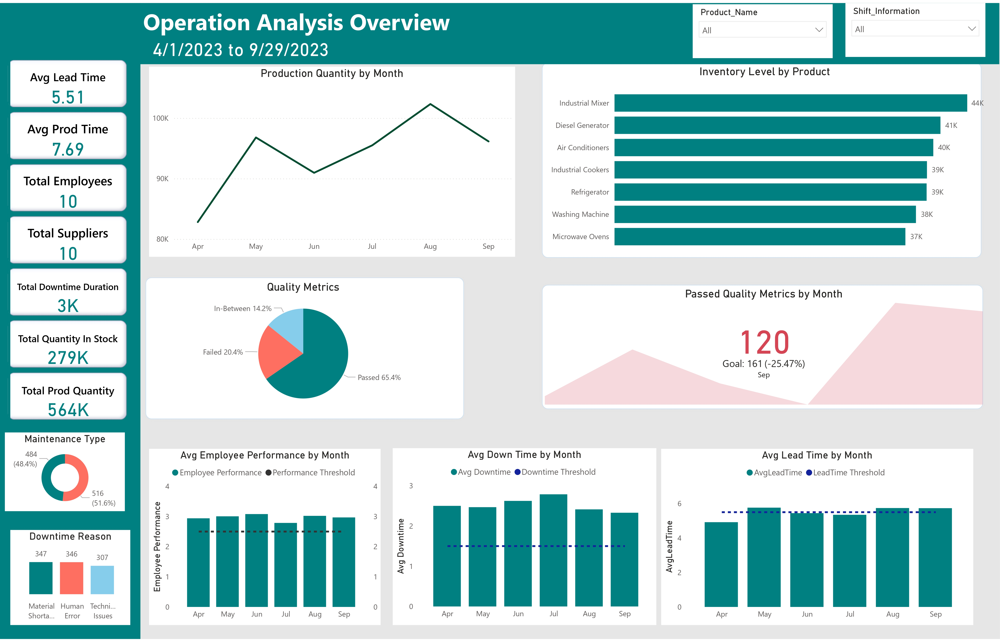
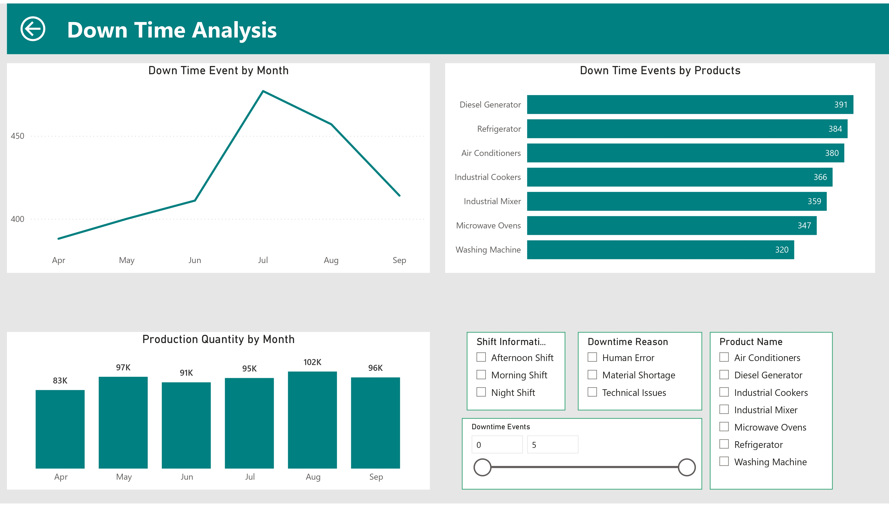
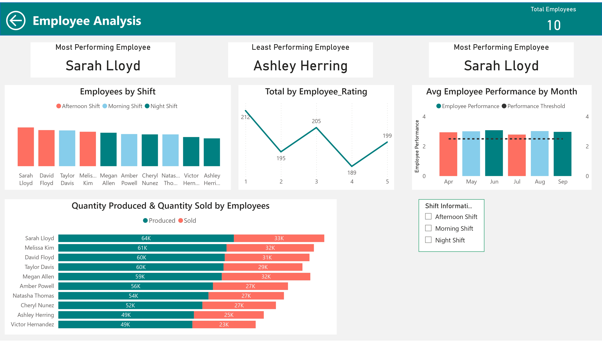
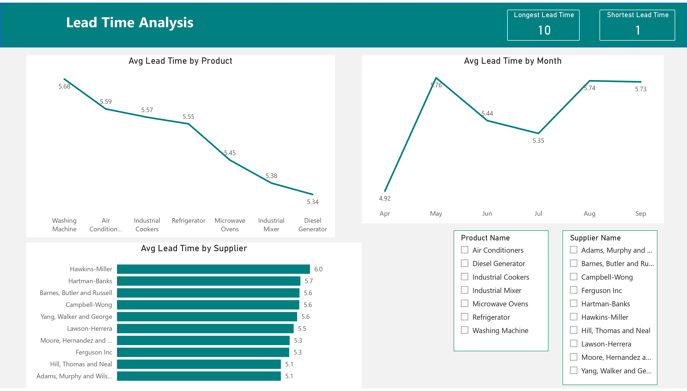
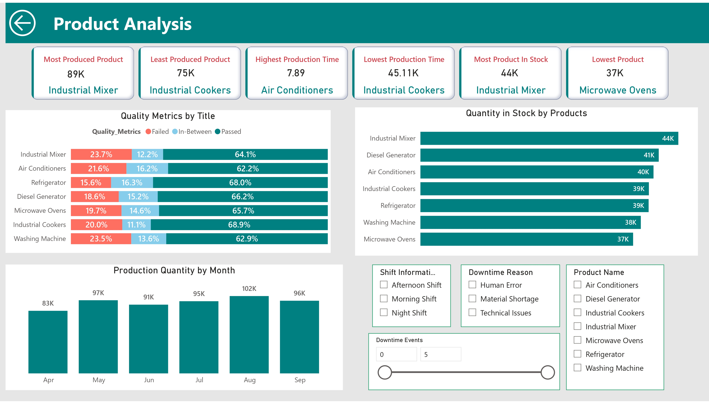
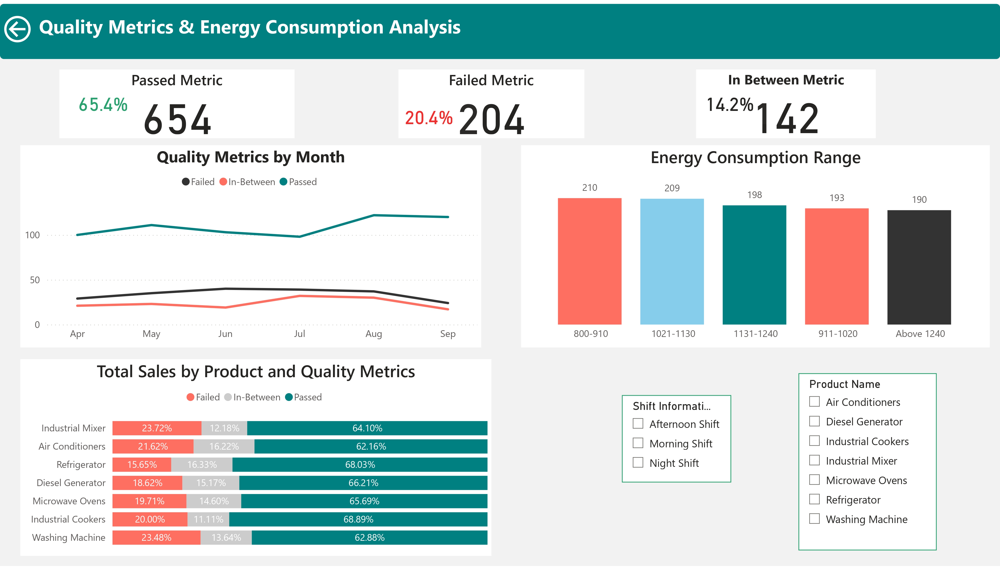

### Real-Time Data Analysis and Visualization for Operational Efficiency at Cozy Tech

This project aimed to enhance operational efficiency at Cozy Tech by analyzing and visualizing data in real-time using Power BI. My role involved collecting, transforming, and analyzing data to identify areas for improvement, such as reducing production downtime, optimizing processes, and improving inventory management. The final deliverable was a set of interactive dashboards that empowered decision-makers with actionable insights. This project highlights Power BI’s capabilities to drive efficiency through data-driven analysis.


### Problem Statement  
Cozy Tech faced challenges in improving operational efficiency, such as unexpected production downtime, inefficient processes, unintuitive reports, and difficulties in inventory management and supply chain coordination. These problems hindered decision-making and impacted the company’s bottom line.

Goal: The project aimed to create real-time, intuitive dashboards to enable Cozy Tech's leadership to make informed, data-driven decisions that would optimize processes, minimize downtime, and improve overall operational performance.


### Data Source and Preparation  
Data Source: The dataset was extracted from Cozy Tech's internal database and contained over 1000 rows. It included details about production operations, product performance, inventory levels, employee performance, supplier lead times, and downtime events.

Data Preparation:  
- Handled missing values and outliers.  
- Created new fields, such as a date table, to enhance time-based analysis.  
- Modeled relationships between tables to optimize report performance and enable efficient querying.

### **Analysis Process**  
**Tools and Techniques**:  
- **Power BI** for data modelling, visualization, and report creation.  
- **DAX** is used to write complex measures to calculate KPIs, such as downtime reasons, employee performance, and production efficiency.  
- **Power Automate** for data refreshes to ensure real-time reporting.

**DAX Measures**:  
Here are a few key DAX measures used in the analysis:
   - **% Failed Metrics**:
     ```DAX
     %FailedMetrics = 
     DIVIDE([FailedMetrics], [Total], 0)
     ```
     *This measure calculates the percentage of failed quality metrics, helping track product quality issues.*
   
   - **Average Employee Rating**:
     ```DAX
     AverageRating = AVERAGE('Operations Data'[Employee_Rating])
     ```
     *Calculates the average employee performance rating, providing insight into employee efficiency and skill.*

   - **Date Range**:
     ```DAX
     Date Range = 
     VAR MinDate = MIN('Operations Data'[Production_Date])
     VAR MaxDate = MAX('Operations Data'[Production_Date])
     RETURN MinDate & " to " & MaxDate
     ```
     *Displays the range of production dates in the dataset, useful for time-based analysis.*

---

### **Appendix A: DAX Measures Used**
A more comprehensive list of the DAX measures utilized in the project:
1. **%FailedMetrics**: 
   ```DAX
   DIVIDE([FailedMetrics], [Total], 0)
   ```
   *Calculates the percentage of failed metrics out of the total operations.*

2. **AverageRating**: 
   ```DAX
   AVERAGE('Operations Data'[Employee_Rating])
   ```
   *Computes the average rating of employees to identify overall performance.*

3. **Avg Prod Time**: 
   ```DAX
   AVERAGE('Operations Data'[Production_Date])
   ```
   *Calculates the average production time.*

4. **AvgHighestProdTime**: 
   ```DAX
   MAXX(VALUES('Product Data'[Product_Name]), CALCULATE([AvgProdTime]))
   ```
   *Finds the product with the highest average production time.*

5. **Date Range**: 
   ```DAX
   VAR MinDate = MIN('Operations Data'[Production_Date])
   VAR MaxDate = MAX('Operations Data'[Production_Date])
   RETURN MinDate & " to " & MaxDate
   ```
   *Returns the production date range.*

6. **FailedMetrics**: 
   ```DAX
   CALCULATE(COUNTROWS('Operations Data'), 'Operations Data'[Quality_Metrics] = "Failed")
   ```
   *Counts the number of failed quality metrics.*

7. **Least Prod Time**: 
   ```DAX
   FIRSTNONBLANK(TOPN(1,VALUES('Product Data'[Product_Name]), [Avg Prod Time]),1)
   ```
   *Identifies the product with the least production time.*

8. **LeastInStock**: 
   ```DAX
   MINX(VALUES('Product Data'[Product_Name]), CALCULATE([TotalQuantityInStock]))
   ```
   *Finds the product with the least quantity in stock.*

9. **LeastPerfEmp**: 
   ```DAX
   LASTNONBLANK(TOPN(1, VALUES('Employee Data'[Employee_Name]), [SumEmpRating], ASC), 1)
   ```
   *Identifies the employee with the lowest performance rating.*

10. **MostProduced**: 
   ```DAX
   MAXX(VALUES('Product Data'[Product_Name]), CALCULATE([SumProdQuantity]))
   ```
   *Finds the product with the highest production quantity.*

---

This section provides a concise overview of the key measures, while the appendix offers deeper insight into each DAX formula for those interested in the technical aspects. Does this structure work for you?

---

###  Key Findings and Insights  
Visualizations: Dashboards included interactive charts and tables for:  
- Operational Analysis: Identified key downtime metrics, such as total quantity in stock and average production time.
---

- Production Downtime Analysis: Identified key downtime causes, such as material shortages and equipment malfunctions.
---

- Employee Performance Metrics: Highlighted the top-performing employees and shifts with the highest productivity.
---

- Supplier Performance: Showed variations in lead times and pinpointed unreliable suppliers.
---
 
- Inventory Management: Tracked stock levels to avoid shortages and overstocking.
---

- Quality Metrics and Energy Consumption**: Identified the number of products that met the required quality standards and analyzed the range of energy consumption across production.
---

### Recommendations:  
- Implement predictive maintenance strategies to reduce equipment breakdowns.  
- Reevaluate relationships with underperforming suppliers to streamline the supply chain.  
- Optimize production schedules based on employee performance and downtime data.

### Challenges and Learnings  
Challenges: One challenge was integrating real-time data into Power BI, which required learning and implementing Power Automate for automatic data refreshes. Additionally, writing complex DAX measures to calculate custom metrics required careful attention to ensure accuracy.

Learnings:  
- Mastered advanced DAX to create complex measures and calculations.  
- Gained proficiency in Power Automate to keep data updated in real-time.  
- Improved my data modelling skills, particularly in creating relationships between multiple datasets.

---

### Impact and Conclusion  
Business Impact: This analysis provided Cozy Tech's leadership with actionable insights that contributed to better decision-making. The project helped the company optimize its production process, reduce downtime, and improve overall operational efficiency.

Summary: This project demonstrated how data-driven decision-making can address critical operational challenges and drive significant business improvements by leveraging Power BI's real-time reporting capabilities.


### Link to Project Files  
Power BI Report: [View Report](docs/CozyTech.pdf)

